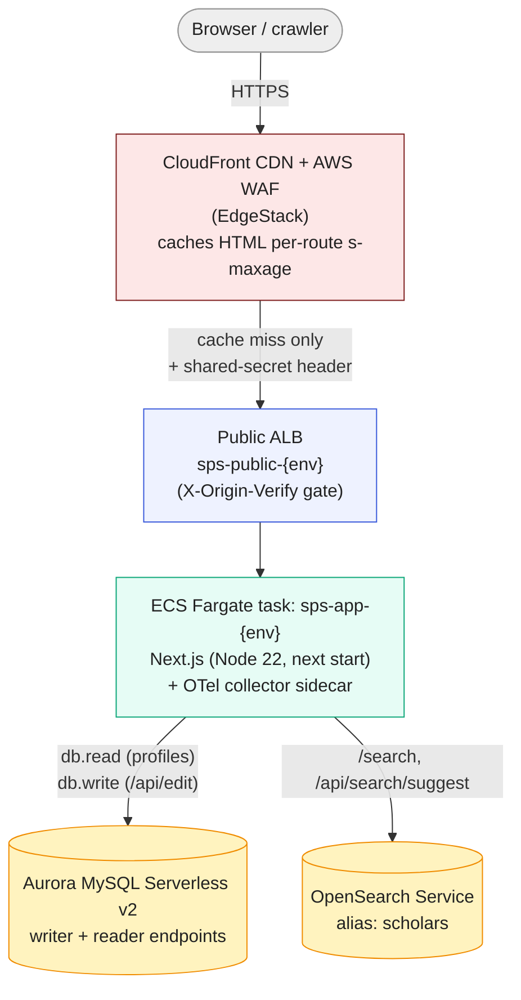
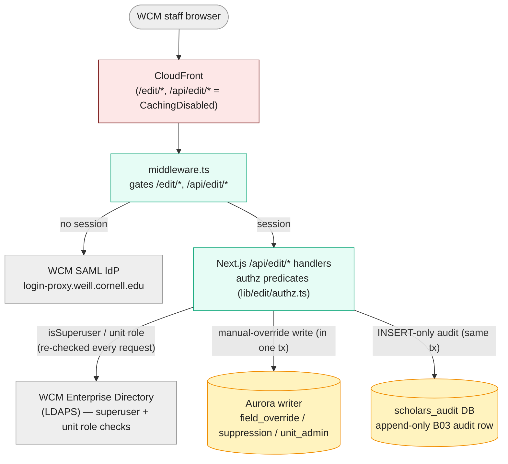
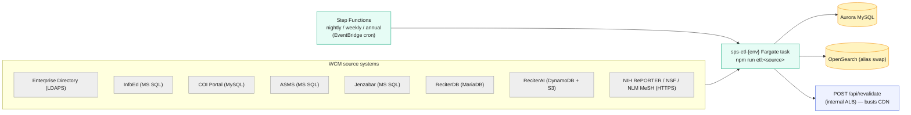

# Architecture overview

**Audience.** ITS colleagues and operators who need the one-page picture of how the
Scholars Profile System (SPS) hangs together in production — before diving into any of the
deeper operational docs. This is the map; the territory is in the companion docs linked
throughout.

**Status.** Reflects the deployed shape as of 2026-05-28. Where this diverges from older
prose in [`PRODUCTION.md`](./PRODUCTION.md) (which predates the final ETL and DB
decisions), this doc is correct and the divergences are called out in
[§ Corrections to older docs](#corrections-to-older-docs).

> Sources of truth this doc consolidates: [`ADR-008`](./ADR-008-infrastructure-as-code.md)
> (nine-stack CDK), [`cdk/lib/config.ts`](../cdk/lib/config.ts) (sizing), [`PRODUCTION_ADDENDUM.md`](./PRODUCTION_ADDENDUM.md)
> (auth, ETL, secrets), [`cloudfront-cache-spec.md`](./cloudfront-cache-spec.md) (edge).
>
> **Visual diagrams:** [`architecture/`](./architecture/index.html) — system context, app & AWS
> topology, app internals, network topology, and the **edge-topology decision** (#502). Open the
> gallery for the pictures this prose describes.

---

## One-paragraph summary

SPS is a **read-mostly Next.js application** that renders ~9,000 public WCM scholar
profiles plus topic, department, center, and search pages. It runs as a container on
**ECS Fargate** behind an **Application Load Balancer**, fronted by **CloudFront + WAF** (with a
WCM-managed **NetScaler** edge layer resolved but not yet inserted — #502).
Its primary store is **Aurora MySQL (Serverless v2)**; search and autocomplete are served
by **Amazon OpenSearch Service**. All displayed data is *derived* — a nightly/weekly
**Step Functions ETL** pulls from WCM source systems (Enterprise Directory, InfoEd, COI,
ReciterDB, ReciterAI) into Aurora and rebuilds the OpenSearch index. Writes happen only
through staff-authenticated `/edit` endpoints (SAML SSO). The whole thing is defined as
code in **AWS CDK** across nine stacks, deployed to a **single AWS account**
(`665083158573`) with **env-prefix isolation** (staging and prod) via **GitHub Actions + OIDC**.

## Request path (what a visitor hits)

- **Cacheable routes** (`/`, `/scholars/*`, `/topics/*`, `/departments/*`, `/centers/*`,
  `/sitemap.xml`) are served from the CloudFront edge for the route's TTL (24 h for
  scholar pages, 6 h for the rest). The Fargate task only renders the *first* request per
  URL per TTL window. This is the system's primary load-shedder — see
  [`cloudfront-cache-spec.md`](./cloudfront-cache-spec.md) and [`PRODUCTION.md` § Caching strategy](./PRODUCTION.md).
- `/search` is `force-dynamic` — every request hits the app and OpenSearch (search-as-you-type, by design).
- **Origin protection:** CloudFront injects an `X-Origin-Verify` shared-secret header; the
  public ALB rejects (403) any request that lacks it, so the ALB DNS can't be used to bypass the CDN/WAF.
- **Edge topology (resolved 2026-07-02, #502):** the settled production edge is **CloudFront + WAF
  → NetScaler → ALB → Fargate** — a WCM-managed **NetScaler** (AWS VPX) inserted between the WAF and
  the public ALB. It is **not yet in the request path**: both CloudFront distributions still point
  straight at their ALB, and NetScaler provisioning is requested (RITM0801140, prod + staging,
  staging-first). Insertion is a decoupled WCM edge change (no CDK change); the #461 WCM-only WAF
  gate and the `:80` default-403 origin guard stay until NetScaler enforces equivalent filtering.
  See the **edge-topology** diagram in [`architecture/`](./architecture/index.html) and
  [`network-security-topology.md`](./network-security-topology.md).

## Write path (staff editing)

- Authentication is **WCM SSO via SAML 2.0** ([`saml-sp.md`](./saml-sp.md)); the session
  cookie is HttpOnly/Secure/SameSite=Lax.
- Authorization is layered (self-edit, superuser, 3-tier unit RBAC) and re-evaluated on
  **every** `/edit/*` request — see [`access-control-rbac.md`](./access-control-rbac.md).
- Every successful write appends a tamper-evident audit row in the same transaction to a
  **separate** `scholars_audit` database — [`b03-audit-log.md`](./b03-audit-log.md).
- Edits land in the **manual-override layer** ([`ADR-005`](./ADR-005-manual-override-layer.md)):
  three tables the ETL never writes, merged into responses at read time, so edits survive
  every rebuild.

## Data pipeline (how the corpus is built)

The request path serves data; this pipeline *produces* it. It runs on a schedule, entirely
off the request path, orchestrated by **Step Functions** (one state machine per cadence)
running **ECS Fargate tasks** (not Lambda — see corrections below).

- **Cadences** (`PRODUCTION_ADDENDUM.md § EtlStack`; authoritative step lists in
  `cdk/lib/etl-stack.ts`): nightly (`ed → reciter → reciter-coi-statements → asms →
  infoed → coi → coi-gap → jenzabar → dynamodb → identity → scholar-tool → mesh-coverage →
  pubmed-retractions → search-index → revalidate → integrity`; staging drops `infoed` — its
  internal host overlaps the VPC CIDR — and inserts `mesh-anchors` before
  `pubmed-retractions`), weekly (`completeness → headshot → spotlight → reporter → nsf →
  gates → nih-profile → pops → reporter-grants → clinical-trials → search-index → revalidate
  → integrity`), annual (`hierarchy` + manual approval gate). Step Functions enforces
  ordering (`reciter` cascades into `dynamodb` within the nightly run) and classifies each
  step by failure tier (reliability-audit #1438): an **abort**-tier step (the spine —
  `ed`/`reciter`/`dynamodb`/`search-index` plus the terminal `integrity` gate) pages P1 via
  `etl-page-<env>` and stops the chain, while a **continue**-tier step (the enrichers) warns
  via `etl-failures-<env>` and proceeds to the next step.
- Each source maps to a connector in [`lib/sources/`](../lib/sources/); the full list of
  upstreams and what fails if each is down is in
  [`dependency-outage-matrix.md`](./dependency-outage-matrix.md).
- After each run the pipeline calls `POST /api/revalidate` (reachable only from the
  internal ALB, SG-to-SG from the ETL security group) to invalidate the changed CDN paths.
- The search index is rebuilt into a fresh versioned index and made live by an **atomic
  alias swap** so the live index never blanks.

## The nine CDK stacks

All infrastructure is AWS CDK (TypeScript) in [`cdk/`](../cdk/), split by blast radius and
change cadence ([`ADR-008`](./ADR-008-infrastructure-as-code.md)):

| Stack | Owns | Cadence | Key doc |
|---|---|---|---|
| `NetworkStack` | VPC, subnets, security groups, VPC endpoints | rare | [`network-security-topology.md`](./network-security-topology.md) |
| `DataStack` | Aurora (PITR + cross-region backup), OpenSearch | rare; deletion-protected | [`restore-drill-runbook.md`](./restore-drill-runbook.md) |
| `SecretsStack` | Secrets Manager definitions, RDS rotation | rare | [`access-control-rbac.md`](./access-control-rbac.md) |
| `AppStack` | ECR, ECS cluster/service/tasks, public + internal ALB, migration task, IAM role split | every deploy | [`DEPLOY-RUNBOOK.md`](./DEPLOY-RUNBOOK.md) |
| `EtlStack` | Step Functions, EventBridge schedules, ETL SG, `etl-failures` SNS | per ETL change | [`PRODUCTION_ADDENDUM.md § EtlStack`](./PRODUCTION_ADDENDUM.md) |
| `EdgeStack` | CloudFront, WAF, security-headers policy, legacy-VIVO redirects. **NetScaler edge layer decided (#502) but not yet inserted** — CloudFront points straight at the ALB today | occasional | [`cloudfront-cache-spec.md`](./cloudfront-cache-spec.md), [`network-security-topology.md`](./network-security-topology.md) |
| `ObservabilityStack` | CloudWatch alarms, SNS page/notify topics, cost guardrails, on-call relay Lambda, reliability dashboard | occasional | [`SLOs.md`](./SLOs.md), [`oncall.md`](./oncall.md) |
| `AnalyticsStack` | Glue + Athena over CloudFront access logs, nightly usage-rollup Lambda, durable (no-expiry) analytics bucket | occasional | — |

(A standalone `dr-backup-vault-stack` provisions the us-west-2 DR vault that DataStack
copies into.) `DataStack` and `NetworkStack` carry `RemovalPolicy.RETAIN` + deletion
protection, so a bad `AppStack` deploy — which happens often — cannot tear down the database.

## Environments

| | Staging | Production |
|---|---|---|
| AWS account | `665083158573` (shared; env-prefix isolation) | `665083158573` (shared) |
| Region / DR region | us-east-1 / us-west-2 | us-east-1 / us-west-2 |
| VPC | shared `its-reciter-vpc01`[^shared-vpc] | own, `10.x.0.0/16` (internal) |
| App tasks | 1 × (1024 CPU / 2048 MiB) | 2 × (2048 CPU / 4096 MiB) |
| Aurora Serverless v2 | 0.5–2 ACU, writer-only | 1–8 ACU, writer + 1 reader |
| OpenSearch | 1 × `t3.medium.search` (fresh shared-VPC domain) | 2 × `m6g.large.search` (multi-AZ) |
| NAT gateways | 1 | 1 (EIP-cap-constrained; see `config.ts`) |
| ETL schedules on first deploy | enabled | disabled (operator-driven first run) |
| Public host | `scholars-staging.weill.cornell.edu` | `scholars.weill.cornell.edu` |

Deploy mechanics, the staging-gates-prod rule, and the prod approval gate are in
[`DEPLOY-RUNBOOK.md`](./DEPLOY-RUNBOOK.md). Sizing source: [`cdk/lib/config.ts`](../cdk/lib/config.ts).

[^shared-vpc]: Staging cut over to the shared, TGW-attached `its-reciter-vpc01`
    (`vpc-08a1873fc8eebae28`) via #1419 (2026-07-02); its old standalone `10.x.0.0/16`
    VPC, Aurora cluster, and OpenSearch domain are `RETAIN`'d until the Phase G
    decommission (tracker #1458). Prod still runs its own `10.x.0.0/16` VPC pending its
    per-env cutover.

## Cross-cutting concerns → where to read

| Concern | Doc |
|---|---|
| Performance / latency / caching | [`performance-baseline.md`](./performance-baseline.md), [`cloudfront-cache-spec.md`](./cloudfront-cache-spec.md) |
| Health, SLOs, alarms, on-call | [`SLOs.md`](./SLOs.md), [`oncall.md`](./oncall.md) |
| Tracing a slow request | [`tracing.md`](./tracing.md) |
| Logs (where, retention, events) | [`logging-reference.md`](./logging-reference.md) |
| Who can do what (RBAC) + break-glass | [`access-control-rbac.md`](./access-control-rbac.md) |
| External dependencies / outage impact | [`dependency-outage-matrix.md`](./dependency-outage-matrix.md) |
| Network / security topology | [`network-security-topology.md`](./network-security-topology.md) |
| What it costs | [`cost-model.md`](./cost-model.md) |
| Data model + field provenance | [`data-dictionary.md`](./data-dictionary.md) |
| Profile URLs (slugs) — derivation, redirects, overrides, canonical-URL flag (#671) | [`data-dictionary.md § Notes`](./data-dictionary.md#notes--gotchas), [`slug-personalization-spec.md`](./slug-personalization-spec.md) |
| Recovery (RPO/RTO, backups) | [`PRODUCTION.md § Recovery objectives`](./PRODUCTION.md), [`restore-drill-runbook.md`](./restore-drill-runbook.md) |

## Corrections to older docs

[`PRODUCTION.md`](./PRODUCTION.md) was written before two decisions were finalized. Where
they conflict, trust this doc and [`PRODUCTION_ADDENDUM.md`](./PRODUCTION_ADDENDUM.md):

- **ETL runs on ECS Fargate tasks orchestrated by Step Functions, not Lambda.** The
  `EventBridge → Lambda → ETL` boxes in `PRODUCTION.md`'s ASCII diagram are superseded;
  `reciter` already runs past Lambda's 15-minute cap. (`PRODUCTION_ADDENDUM.md § EtlStack`,
  D1 deviation.)
- **Aurora is Serverless v2 (ACUs), not a fixed `db.r6g.large` instance.** The connection
  math in `PRODUCTION.md § Database connection pooling` still holds directionally
  (`connectionLimit=15`/task; connections alarm at 80), but the instance class reference is stale.
