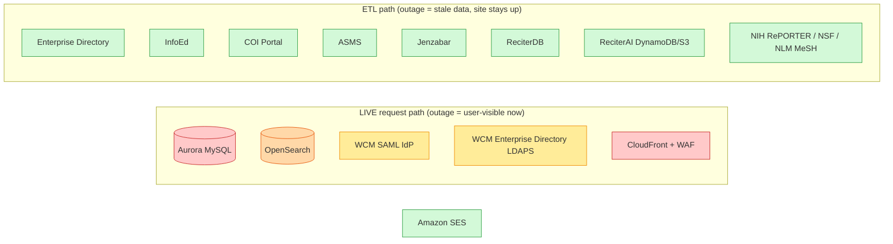

# Upstream dependency & outage matrix

**Audience.** Operators and ITS colleagues answering *"X is down — does Scholars break,
and what exactly stops working?"* This is the consolidated view; the facts are otherwise
scattered across [`PRODUCTION_ADDENDUM.md`](./PRODUCTION_ADDENDUM.md),
[`architecture-overview.md`](./architecture-overview.md), and the connectors in
[`lib/sources/`](../lib/sources/).

**Key distinction this doc turns on:** SPS serves a *derived snapshot*. Almost every
external system feeds the **ETL pipeline**, not the live request path. So when a source
goes down, the public site keeps serving the last good snapshot — it just stops *updating*.
Only a handful of dependencies are in the **live request path**; those are the ones whose
outage is user-visible immediately.

---

## At a glance

Severity = **user-visible impact if the dependency is unavailable**, not how important the
data is.

## Live request-path dependencies

These are in the hot path. An outage degrades or breaks the public site immediately.

| Dependency | What uses it | Impact if unavailable | Mitigation in place |
|---|---|---|---|
| **CloudFront + WAF** (AWS) | Every public request; TLS, caching, edge filtering | **Total outage** of the public site. | AWS-managed, multi-edge; the single hardest dependency to lose. No SPS-side failover. |
| **Aurora MySQL** (AWS, in-VPC) | All profile/topic/dept/center page renders (`db.read`); all `/api/edit` writes (`db.write`) | Cache-warm pages keep serving from CloudFront until their TTL expires (24 h scholars, 6 h others); **cache-cold pages 5xx**; all editing stops. | Serverless v2 auto-scaling (prod 1–8 ACU); prod reader endpoint; PITR + cross-region backup ([`restore-drill-runbook.md`](./restore-drill-runbook.md)). CDN TTL is the shock absorber. |
| **OpenSearch Service** (AWS, in-VPC) | `/search` and `/api/search/suggest` (autocomplete) only | **Search + autocomplete fail**; all other pages (served by Aurora) are unaffected. | Prod 2-node multi-AZ; `ClusterStatus.red` and JVM-pressure alarms ([`SLOs.md`](./SLOs.md)). Index rebuilt via atomic alias swap so a failed rebuild never blanks the live index. |
| **WCM SAML IdP** (`login-proxy.weill.cornell.edu`) | Staff login to `/edit/*` (write path only) | **Staff cannot start a new editing session.** Public read path is unaffected (no login required). Existing sessions last up to 8 h. | Read path is fully decoupled from auth. Two-cert rollover handled in `SAML_IDP_CERT` ([`saml-sp.md`](./saml-sp.md)). |
| **WCM Enterprise Directory** (LDAPS) | *Live* superuser + unit-role authorization check on **every** `/edit/*` request (not cached) | **Editing is denied for everyone** (the check is fail-closed: a directory error denies, never grants). Public read path unaffected. | Intentional fail-closed design — an LDAP outage cannot escalate privilege, only withhold it. See [`access-control-rbac.md`](./access-control-rbac.md). |
| **Amazon SES** (AWS) | "Request a change" server mailer + slug-request notifications (write path, low volume) | Change-request emails fail; the failure is logged (`request_change_receipt_failed`, `slug_request_notify_failed`) and surfaced to the user. No effect on reads or on the audit trail. | Behind a feature flag; failures are caught and logged, not fatal. See [`ses-sender-verification.md`](./ses-sender-verification.md). |

## ETL-path dependencies (stale-but-up)

These feed the scheduled ETL. If one is unavailable **at run time**, the public site keeps
serving the previous snapshot; the affected section simply stops refreshing. Each pull is
logged to `etl_run` and (for failures) pages via the `etl-failures-${env}` SNS topic /
Step Functions alarms.

| Source | Connector | Cadence | Populates | Impact of an outage |
|---|---|---|---|---|
| **WCM Enterprise Directory** (LDAPS) | [`lib/sources/ldap.ts`](../lib/sources/ldap.ts) | nightly | `Scholar`, `Appointment`, dept/division org units, clinical-profile links, postdoc/student mentor edges, VIVO redirect set | New hires / title changes / departures don't appear until ED is reachable again. The roster as a whole goes stale, not blank. |
| **InfoEd** (MS SQL) | [`lib/sources/mssql-infoed.ts`](../lib/sources/mssql-infoed.ts) | nightly | `Grant` (funding) | Funding section stops updating; existing grants still render. |
| **COI Portal** (MySQL) | [`lib/sources/mysql-coi.ts`](../lib/sources/mysql-coi.ts) | nightly | `CoiActivity` (disclosures) | Disclosures stop updating. |
| **ASMS** (MS SQL) | [`lib/sources/mssql-asms.ts`](../lib/sources/mssql-asms.ts) | nightly | `Education` | Education/training entries stop updating. |
| **Jenzabar** (MS SQL) | [`lib/sources/mssql-jenzabar.ts`](../lib/sources/mssql-jenzabar.ts) | (per spec) | `PhdMentorRelationship`, GS faculty | Graduate-school mentoring chips stop updating. See [`etl/jenzabar-gs-faculty-probe.md`](./etl/jenzabar-gs-faculty-probe.md). |
| **ReciterDB** (MariaDB) | [`lib/sources/reciterdb.ts`](../lib/sources/reciterdb.ts) | weekly | `Publication`, `PublicationAuthor`, MeSH terms, abstracts, citation counts | Publications stop updating. **This is the heavy job (~5 min) and it cascades** — it `deleteMany`s `Publication` and the `dynamodb` step must follow it (see consistency window below). |
| **ReciterAI** (DynamoDB + S3) | [`etl/dynamodb`](../etl/dynamodb/), [`etl/spotlight`](../etl/spotlight/), [`etl/hierarchy`](../etl/hierarchy/) | weekly / annual | `Topic`, `PublicationTopic`, `PublicationScore`, `Spotlight`, `Subtopic`, impact scores, synopses | Topics, the home-page "Selected research" spotlight, and relevance signals stop updating. See [`spotlight-runbook.md`](./spotlight-runbook.md). |
| **NIH RePORTER** (`api.reporter.nih.gov`) | [`etl/reporter`](../etl/reporter/), [`etl/nih-profile`](../etl/nih-profile/), [`lib/nih-reporter.ts`](../lib/nih-reporter.ts) | nightly/weekly | Grant abstracts, keywords, RePORTER PI profile links, `appl_id` deep-links | Grant enrichment stops updating; grants still render with InfoEd data. |
| **NSF Awards API** (`api.nsf.gov`) | [`etl/nsf`](../etl/nsf/) | (per spec) | Grant abstracts for NSF awards | NSF abstract enrichment stops. |
| **NLM MeSH** (`nlmpubs.nlm.nih.gov`) | [`etl/mesh-descriptors`](../etl/mesh-descriptors/) | annual (NLM publishes in Nov) | `MeshDescriptor` catalog (taxonomy-aware search) | MeSH catalog stays at the last release; no user-visible effect mid-year. See [`mesh-resolver-cache`](./taxonomy-aware-search.md). |

### The one internal consistency window worth knowing

`reciter` (weekly) deletes and rewrites `Publication`, cascading `PublicationTopic`. Until
the following `dynamodb` step finishes, topic edges are missing for just-rewritten
publications. The UI masks this with a **"topics updating" placeholder** driven by
`EtlState.lastTopicRebuildAt` (auto-expires 30 min). This is expected behavior during the
weekly run, not an incident. (`PRODUCTION_ADDENDUM.md § The reciter → dynamodb consistency window`.)

## AWS platform dependencies (supporting, not data)

| Dependency | Role | Impact if unavailable |
|---|---|---|
| **Secrets Manager** | Injects DB/OpenSearch/SAML/ETL secrets into tasks at start | Running tasks already hold their secrets; a *new* task launch (deploy, scale-out) fails until it recovers. Reached via VPC interface endpoint, off the NAT. |
| **ECR** | Container image registry | Running tasks unaffected; new deploys/scale-outs can't pull. Image layers pulled via S3 gateway endpoint. |
| **NAT gateway** (1 per env) | Outbound internet for in-VPC tasks (ETL external pulls, SES, X-Ray) | If its AZ fails, tasks in the *other* AZ lose outbound (prod runs a single NAT — accepted trade-off, `config.ts`). In-VPC traffic (Aurora, OpenSearch) and AWS-endpoint traffic are unaffected. |
| **EventBridge / Step Functions** | Fires and orchestrates ETL | ETL doesn't run; site serves the last snapshot. Cadence alarms (`treatMissingData: BREACHING`) catch a schedule that fails to start at all. |
| **CloudWatch / SNS** | Alarms + on-call fan-out | Loss of *observability*, not of service. The on-call relay Lambda failure routes to the notify (email) topic, not back through itself. See [`oncall.md`](./oncall.md). |

## How to confirm a dependency is the cause

1. **Public site fully down?** → CloudFront or Aurora (cache-cold). Check the Edge + App
   dashboards and the `sps-alb-5xx-rate` / `sps-aurora-*` alarms ([`SLOs.md`](./SLOs.md)).
2. **Only search/autocomplete down?** → OpenSearch. Check `sps-opensearch-cluster-red` / JVM pressure.
3. **Only editing broken, reads fine?** → SAML IdP (can't log in) or Enterprise Directory
   (authz fail-closed). Check `saml_callback_failed` / `superuser_check_failed` log events
   ([`logging-reference.md`](./logging-reference.md)).
4. **A profile section is stale (not blank)?** → that section's ETL source. Query `etl_run`
   for the source's last `completedAt` / `status`; check the `etl-failures` alarm history.
5. **Change-request emails not arriving?** → SES. Check `request_change_receipt_failed`.

## Known gaps / caveats

- **No source-level SLAs are documented here** — these are internal WCM systems and
  third-party public APIs (NIH/NSF/NLM) with best-effort availability. Treating them as
  "may be down at any run" is the design posture; the ETL is idempotent and re-runs the
  next cadence.
- **DR-region behavior for live dependencies** (Aurora/OpenSearch) is a *recovery*
  exercise, not automatic failover — see [`PRODUCTION.md § Recovery objectives`](./PRODUCTION.md)
  and [`restore-drill-runbook.md`](./restore-drill-runbook.md).
