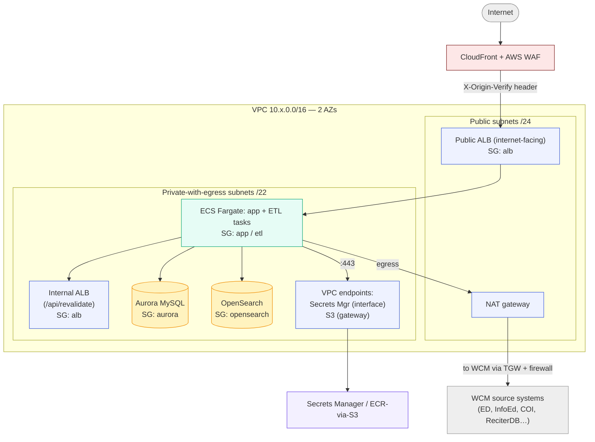

# Network & security topology

**Audience.** ITS security colleagues and operators who need a single review-ready picture
of the VPC, subnets, security groups, egress, and edge filtering — without reading eight
CDK files.

**Authoritative source.** [`cdk/lib/network-stack.ts`](../cdk/lib/network-stack.ts) (VPC +
SGs), [`cdk/lib/config.ts`](../cdk/lib/config.ts) (per-env values), plus the SG-to-SG
ingress and endpoints added by AppStack/EtlStack/DataStack
([`PRODUCTION_ADDENDUM.md`](./PRODUCTION_ADDENDUM.md)). Decisions and threat model:
[`ADR-008`](./ADR-008-infrastructure-as-code.md). IAM roles and human access:
[`access-control-rbac.md`](./access-control-rbac.md).

---

## Account & region boundary

- **Two separate AWS accounts** — staging and production — not one account with two stack
  sets. A misconfigured IAM grant or a `cdk deploy` with the wrong `-c env` cannot reach
  production from a staging operation; the blast radius of any staging mistake is the
  staging account ([`ADR-008` decision 5](./ADR-008-infrastructure-as-code.md)).
- **Primary region `us-east-1`; DR region `us-west-2`** (Aurora cross-region backup copy only).
- Org-level controls (SCPs, GuardDuty, org CloudTrail) are assumed administered above this
  project and are explicitly out of ADR-008's scope.

## VPC layout (per environment)

| | Staging | Production |
|---|---|---|
| VPC CIDR | `10.x.0.0/16` (internal) | `10.x.0.0/16` (internal) |
| AZs | `us-east-1a`, `us-east-1b` | same |
| Public subnets | /24 per AZ — ALB + NAT only | same |
| Private-with-egress subnets | /22 per AZ — ECS tasks, Aurora, OpenSearch, ETL | same |
| NAT gateways | 1 | 1 (EIP-cap-constrained; single-NAT trade-off documented in `config.ts`) |

**Nothing that holds data is in a public subnet.** ECS tasks, Aurora, and OpenSearch live
in private-with-egress subnets — unreachable from the internet, able only to reach *out*
through the NAT (or, for AWS services, via VPC endpoints — see below).

## Security groups (default-deny, SG-to-SG)

The three base SGs are created with **no ingress** (default-deny) and allow-all egress;
reachability is defined by explicit SG-to-SG rules added by the stack that owns each
listener/service. There are **no IP allowlists** for intra-VPC reachability — every rule is
SG-referenced.

| SG | Ingress (who can reach it) | Owned/added by |
|---|---|---|
| `alb` (public ALB) | `:80` from `0.0.0.0/0` **but** the listener default action is `403`; a priority-1 rule forwards only when `X-Origin-Verify` matches the CloudFront-injected secret | NetworkStack (SG) / AppStack + EdgeStack (rule) |
| `alb` (internal ALB listener) | `:80` from the `etl` SG only (the `/api/revalidate` path) | EtlStack |
| `app` (ECS app tasks) | from the `alb` SG only | AppStack |
| `etl` (ETL tasks) | none inbound (egress only) | NetworkStack |
| `aurora` | from `app` SG + `etl` SG only | DataStack |
| `opensearch` | from `app` SG + `etl` SG only (private ENI, data plane) | DataStack |
| Secrets Manager interface-endpoint SG | `:443` from `app` SG + `etl` SG only (CDK's default `:443 from VPC CIDR` is suppressed) | AppStack (B17) |

## Egress confinement (VPC endpoints)

Keeps AWS-service traffic off the NAT / public internet:

- **Secrets Manager interface endpoint** — task-execution-role secret pulls stay on the AWS
  backbone.
- **S3 gateway endpoint** — ECR image-layer pulls (S3-backed) stay off the NAT;
  route-table association only, no SG.
- **OpenSearch** is intentionally *not* an endpoint — the managed domain exposes a private
  ENI inside the VPC, so data-plane queries already stay on the AWS network. (An interface
  endpoint would only matter for the OpenSearch control plane, which the runtime never
  calls — `PRODUCTION_ADDENDUM.md § VPC endpoints`.)
- **X-Ray** export from the OTel sidecar currently goes via NAT (no endpoint provisioned;
  out of B24 scope — [`tracing.md`](./tracing.md)).

## WCM-internal connectivity (the ETL's hardest dependency)

The ETL must reach WCM-internal source systems (ED LDAP, InfoEd, COI, ReciterDB). This has
two halves:

1. **DNS resolution** — three RAM-shared Route 53 Resolver FORWARD rules (for
   `weill.cornell.edu`, `med.cornell.edu`, `wcmc.ad.net`) from the Central Services account
   (`091981818184`) are associated to this VPC, sending those domains to the shared
   outbound resolver — the same wiring ReCiter's EKS VPC uses. Codified in NetworkStack.
2. **Routing** — reaching the resolved IPs additionally needs the Central Services Transit
   Gateway attachment + the WCM-side firewall opened for this VPC's CIDR. **Those are owned
   by the Central Services account / WCM network, not by SPS**, and are tracked separately.
   This is the known connectivity gap that gates first ETL data population — see
   [`data-population-runbook.md`](./data-population-runbook.md).

## Edge & WAF

- **CloudFront** fronts everything; the public ALB is reachable only with the
  `X-Origin-Verify` shared-secret header CloudFront injects (so the ALB DNS — published
  nowhere but discoverable — can't bypass the CDN/WAF). Secret in
  `scholars/${env}/edge/origin-shared-secret`; rotation runbook in
  [`PRODUCTION_ADDENDUM.md § Origin protection`](./PRODUCTION_ADDENDUM.md).
- **AWS WAF** attaches to the distribution: a rate-based rule (1000 req / 5 min / IP) plus
  AWS Managed Rules. The production WAF topology is decided (#502): CloudFront + AWS WAF →
  NetScaler → ALB → Fargate, with the NetScaler (AWS VPX, WCM network team) being provisioned
  via RITM0801140 (prod+staging, staging-first). A WCM-only access gate (#461)
  stays in place meanwhile. **Do not lift the WCM-only gate until the NetScaler enforces
  equivalent filtering.**
- **TLS:** ACM certs for `scholars[-staging].weill.cornell.edu` are provisioned and rotated
  by WCM ITS (not CDK). HSTS ships on the security-headers policy; CSP and the other headers
  are filled in by B21 ([`ADR-007`](./ADR-007-csp-script-src-strategy.md)).
- **Cookies are stripped on cacheable routes** (the single most important cache-key knob);
  full cookie/header forwarding only on the uncacheable writer routes
  ([`cloudfront-cache-spec.md`](./cloudfront-cache-spec.md)).

## Secrets posture (network-relevant slice)

- All credentials live in **Secrets Manager**; referenced by ARN only — **no secret value
  ever appears in CDK source or a synthesized template** (ADR-008 hard rule).
- The ECS **task-execution role** can `GetSecretValue` on exactly the enumerated consumer
  ARNs; the **task role** (runtime app identity) has **zero** secret access — app code sees
  secrets only as env vars injected at task start. Full IAM detail:
  [`access-control-rbac.md`](./access-control-rbac.md).

## Threat-model summary (from ADR-008)

In scope and enforced by this topology: IAM least privilege (role split), private-subnet
placement, SG-to-SG-only reachability, egress confinement via endpoints, edge filtering
(WAF), account-boundary environment isolation, no long-lived CI credentials (OIDC), and
drift detection (`cdk diff`). Explicitly out of scope: application-layer authn/authz (that
is SAML + RBAC, see [`access-control-rbac.md`](./access-control-rbac.md)), secret *values*
(provisioned out-of-band), org-level controls, and runtime intrusion detection.

## Known gaps / caveats

- **Single NAT in prod** — an AZ failure costs outbound for tasks in the other AZ
  (accepted; raise EIP quota and bump to 2 post-launch).
- **TGW + WCM firewall are not SPS-owned** — the ETL connectivity path depends on another
  team; resolver associations are codified but routing is external.
- **NetScaler not yet in the request path** (#502, RITM0801140) — the WAF topology is resolved
  (CloudFront + AWS WAF → NetScaler → ALB → Fargate) but the NetScaler (AWS VPX, WCM network
  team) is still being provisioned; both distributions point straight at their ALB today, and
  the #461 WCM-only gate stays until it enforces equivalent filtering.
- **`cdk diff` is the only drift detector** — there is no continuous config-drift scanner;
  console changes are caught at the next diff, not in real time.
