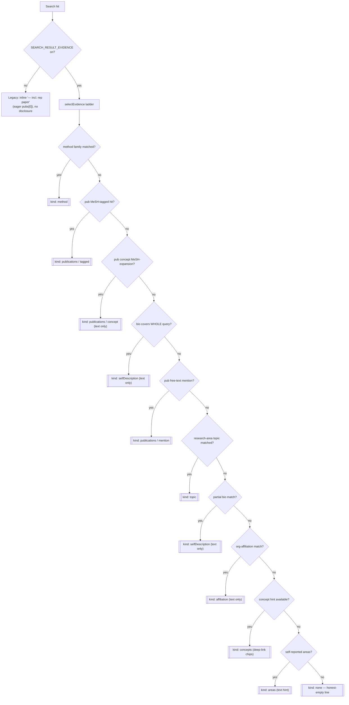
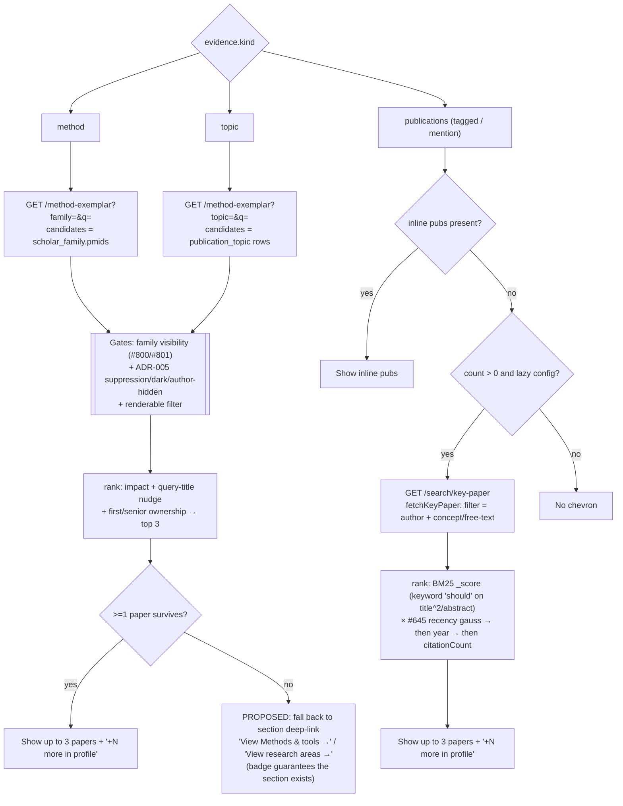

# People-search card: how we decide what snippet to show

How a People search-result card chooses the **one** evidence snippet it renders, and
how that snippet's expandable disclosure ("dropdown") resolves its papers.

**One-line heuristic:** show the single highest-priority evidence that proves *why*
this person matched the query — preferring query-literal evidence (method / MeSH-tagged /
full-query bio / mention) over who-they-are hints (research area / concepts / areas);
for method, topic, and publication matches, reveal up to 3 representative papers on
expand, ranked by **keyword relevance × recency** with impact only as a tiebreak; and
**never show an empty disclosure** — degrade to a profile-section link.

Source of truth: `lib/api/result-evidence.ts` (`selectEvidence`), `components/search/people-result-card.tsx`
(the disclosure render), `lib/api/method-exemplar.ts` + `lib/api/search.ts` `fetchKeyPaper` (the paper resolvers).

---

## 1. Which evidence kind wins (the priority ladder)

All disclosures require `SEARCH_RESULT_EVIDENCE=on`. With the flag off, the card takes
the legacy path: an inline `— incl. <representative paper>` (eager, `pubs[0]`), no chevrons.

`selectEvidence` returns the **first** matching kind, top to bottom:

Notes:
- **name** is never surfaced as a snippet (#1267) — the card already prints the name; a
  name match falls through to genuinely informative evidence below.
- Query-literal evidence (method, MeSH-tagged, full-query bio, mention) outranks
  **topic**, because a research area's displayed PARENT label can look unrelated to the
  query (e.g. a "stem cells" subarea shown under a "Gastroenterology" parent).
- `publications/concept`, `selfDescription`, `affiliation`, `concepts`, `areas` are
  **text/chip** kinds — no expandable paper disclosure.

---

## 2. How a disclosure resolves its papers (method / topic / publications)

Only three kinds get the expandable paper disclosure: `method`, `topic`, and
`publications` (tagged or mention). Each fetches lazily on expand; the ranking differs.

### Why "never empty"
- For **publications**, the chevron only renders when the server already knows there is
  content (`count > 0`, or inline pubs) — so the key-paper fetch effectively always
  returns ≥1.
- For **method / topic**, the candidate set is the *whole* family/topic pmid set (the
  literal query is a ranking nudge, **never a filter**), so empties are rare — they come
  only from per-publication suppression / non-renderable stubs on the specific match,
  which we must not bypass. When that rare empty happens, the disclosure degrades to a
  **profile-section deep-link** instead of retracting: the badge firing *guarantees* the
  scholar has that section (the index's `methodFamily` field, built with the same
  visibility gate, is what the badge matched on). *(This fallback is proposed, not yet
  shipped — marked PROPOSED above.)*

---

## 3. The disclosure ranking, at a glance

| Disclosure | Candidate set | Ranking (top → tiebreak) |
|---|---|---|
| **Key paper** (publications) | author's pubs in the matched concept subtree, or free-text scan | **BM25 keyword `_score`** (title^2/abstract `should`) **× #645 recency gauss** → `year` → `citationCount` |
| **Method / Topic exemplar** | scholar_family pmids / publication_topic pubs (post visibility + suppression gates) | impact (`impactScore`/citations) + query-title nudge + first/senior ownership → top 3 |

The key-paper ranking favors **keyword relevance and recency over impact** (impact is the
last tiebreak); the method/topic exemplar is impact-led with a query-title nudge.
